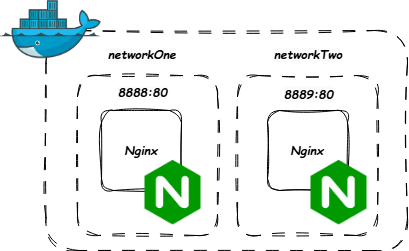

# DockerBridge

Simple experiment with docker networking

## Table of contents
* [General info](#general-info)
* [Prerequisites](#prerequisites)
* [Technologies](#technologies)
* [Status](#status)

## Prerequisites

Create two networks:

`docker network create networkOne`

and

`docker network create networkTwo`

## General info

Project contains two nginx containers, each residing in its own network.

<p align="center">
<p align="center">Pic.1 Visualization of project run with docker</p>

first we check the config of our default network bridge

`docker network inspect bridge`

and in response we check that ICC option is enabled

```
[
    {
        ...
        "Options": {
            "com.docker.network.bridge.default_bridge": "true",
            "com.docker.network.bridge.enable_icc": "true",
            "com.docker.network.bridge.enable_ip_masquerade": "true",
            "com.docker.network.bridge.host_binding_ipv4": "0.0.0.0",
            "com.docker.network.bridge.name": "docker0",
            "com.docker.network.driver.mtu": "1500"
        },
        "Labels": {}
    }
]
```

we run the project with:

`docker compose up`

lets enter one of the containers and run:

`curl http://<host IP>:8889`

in a response we should get:

```
<!DOCTYPE html>
<html>
<head>
    <title>Hello, Nginx!</title>
</head>
<body>
    <h1>Hello, Nginx!</h1>
    <p>This is a test page served by Nginx in a Docker container.</p>
</body>
</html>
```

next we stop docker desktop/daemon and add to `%userprofile%/.docker/daemon.json` or `~/.docker/daemon.json`:

```
{
    "icc": false
}
```

we start docker again and make sure that ICC is disabled with:

`docker network inspect bridge`

our response is:

```
[
    {
        ...
        "Options": {
            "com.docker.network.bridge.default_bridge": "true",
            "com.docker.network.bridge.enable_icc": "false",
            "com.docker.network.bridge.enable_ip_masquerade": "true",
            "com.docker.network.bridge.host_binding_ipv4": "0.0.0.0",
            "com.docker.network.bridge.name": "docker0",
            "com.docker.network.driver.mtu": "1500"
        },
        "Labels": {}
    }
]
```

we run the project again with:

`docker compose up`

we enter one of the containers again and run again:

`curl http://<host IP>:8889`

in a response we should get again:

```
<!DOCTYPE html>
<html>
<head>
    <title>Hello, Nginx!</title>
</head>
<body>
    <h1>Hello, Nginx!</h1>
    <p>This is a test page served by Nginx in a Docker container.</p>
</body>
</html>
```

## Technologies
* Docker
* Nginx

## Status
Project is: _finished_